# Ray Tracing Demo - *a breakdown by robogeekoid*

So a couple of weeks ago this gem appeared on the Agon Discord

`rtdemo.bbc`

A very respectable demonstration of a Ray Tracing scene from "back-in-the-day" when we could only dream of our modern world with realistic 3d real-time rendered full colour gorgeousness that we are so used to now.

This was a conversion to 37 lines of Agon BASIC by Christian Pinder (of Elite:TNK fame) of an original maybe lost to time. (Actually, it may be [this one](https://bbcmic.ro/#%7B%22v%22%3A1%2C%22program%22%3A%22MODE1%3AVDU5%3AB%3D0%5CnFORN%3D8TO247%3AFORM%3D0TO319%5CnX%3D0%3AY%3D-.1%3AZ%3D3%3AU%3D%28M-159.5%29%2F160%3AV%3D%28N-127.5%29%2F160%3AW%3D1%2FSQR%28U*U%2BV*V%2B1%29%3AU%3DU*W%3AV%3DV*W%3AI%3DSGNU%3AG%3D1%5CnE%3DX-I%3AF%3DY-I%3AP%3DU*E%2BV*F-W*Z%3AD%3DP*P-E*E-F*F-Z*Z%2B1%3AIFD%3E0T%3D-P-SQRD%3AIFT%3E0X%3DX%2BT*U%3AY%3DY%2BT*V%3AZ%3DZ-T*W%3AE%3DX-I%3AF%3DY-I%3AG%3DZ%3AP%3D2*%28U*E%2BV*F-W*G%29%3AU%3DU-P*E%3AV%3DV-P*F%3AW%3DW%2BP*G%3AI%3D-I%3AGOTO40%5CnIFV%3C0P%3D%28Y%2B2%29%2FV%3AV%3D-V*%28%28INT%28X-U*P%29%2BINT%28Z-W*P%29AND1%29%2F2%2B.3%29%2B.2%5CnB%3DB%2B3*SQRV%3AGCOL0%2C3-INTB%3AB%3DB-INTB%5CnPLOT69%2C4*M%2C4*N%3ANEXT%2C%22%7D) - in just 7 lines of BBC BASIC!) 

It looked like this:
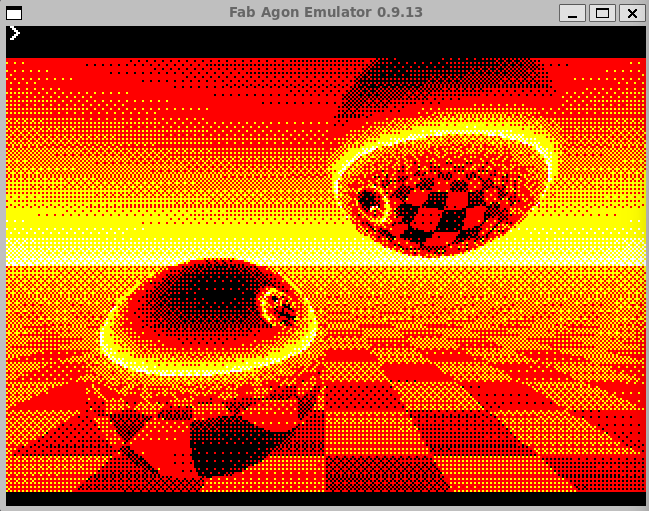

You can see a checkerboard floor receding into the horizon with a graduated sky overhead. Floating in mid air are two perfectly mirrored balls, impossibly reflecting the scene around them.  It uses **just 4 colours** but uses a dithering effect to give a sense of depth to the world.

## The CODE
Sure, I hear you say - this is BASIC, how hard can it be to understand?  Well, it turns out, it is not so easy.  There is no "define sphere" function, no vertices or plane equation describing the floor, and certainly not a line of OpenGL in sight.

But, fortunately for us, it is heavily commented by Christian as he teased apart it's inner workings. 
Here it is in it's full glory:

```BASIC
   10 DIM A(16):A(0)=0:A(1)=24:A(2)=6:A(3)=30:A(4)=36:A(5)=12:A(6)=42:A(7)=18:A(8)=9:A(9)=33:A(10)=3:A(11)=27:A(12)=45:A(13)=21:A(14)=39:A(15)=15
   20 REM ordered dither pattern stored in A() array above; 4x4 grid of thresholds
   30 MODE 10:REM set 320x240, 4 colour graphics mode
   40 VDU 23,1,0:REM hide flashing text cursor
   45 VDU 23,0,192,0:REM logical screen scaling off
   50 X=0:Y=-.1:Z=3:REM camera position
   60 FOR N=8 TO 238:REM iterate over screen pixel rows
   70   FOR M=0 TO 319:REM iterate over screen pixel columns
   80     U=(M-159.5)/160:REM x component of ray vector
   90     V=(N-127.5)/160:REM y component of ray vector
  100     W=1/SQR(U*U+V*V+1):REM z component of ray vector
  110     U=U*W:V=V*W:REM normalise x and y components
  120     I=SGNU:REM is ray facing left or right? I becomes x and y coordinates for sphere
  130     C=FNray(X,Y,Z,U,V,W,I):REM fire ray from X,Y,Z along U,V,W
  140     GCOL0,3-(48*SQRC+A(M MOD4+N MOD4*4)/3)DIV16:REM set draw colour using ordered dithering
  150     PLOT69,M,247-N:REM plot pixel (4x multiplier due to resolution-independent graphics coordinates - 1280x1024)
  160   NEXT
  170 NEXT
  175 VDU 23,0,192,1: REM logical screen scaling back on
  176 VDU 23,1,1: REM show cursor
  180 END
  190 DEFFNray(X,Y,Z,U,V,W,I)
  200 E=X-I:F=Y-I:G=Z:REM vector from sphere centre to ray start
  210 P=U*E+V*F-W*G:REM dot product? Z seems to be flipped
  220 D=P*P-E*E-F*F-G*G+1
  230 IF D<=0 THEN =FNc(X,Y,Z,U,V,W):REM didn't hit anything; return colour
  240 T=-P-SQRD:IF T<=0 =FNc(X,Y,Z,U,V,W):REM still didn't hit anything; return colour
  250 X=X+T*U:Y=Y+T*V:Z=Z-T*W:REM new ray start position
  260 E=X-I:F=Y-I:G=Z:REM vector from sphere centre to new ray start
  270 P=2*(U*E+V*F-W*G):REM dot product shenanigans?
  280 U=U-P*E:V=V-P*F:W=W+P*G:REM new ray direction vector
  290 I=-I:REM we'd hit one sphere, so flip x and y coordinates to give other
  300 =FNray(X,Y,Z,U,V,W,I):REM return colour from new ray
  310 DEFFNc(X,Y,Z,U,V,W):REM generate pixel colour
  320 IF V>=0 =V:REM facing up at all? return ray Y component for simple sky gradient
  330 P=(Y+2)/V:REM use height for overall checkerboard scale and y component of vector for perspective
  340 =-V*((INT(X-U*P)+INT(Z-W*P)AND1)/2+.3)+.2:REM multiply simple gradient by checkerboard
```

My intention in this article is to breakdown the code a little and explain what the various lines do, and so, how it works.

Here goes!

## Part 1 Ray Tracing : *Who is this Ray chap anyway?*
First you need to know a little about what we are trying to achieve here.  This code is rendering a 3D scene using a technique called "Ray Tracing".

Ray tracing is essentially painting each pixel in a scene using rays of light bouncing off objects to give each pixel its colour.
Our eyes essentially work by taking in light (rays) from the surrounding world either directly from a light source or after they have hit one or many objects many many times. 

Ray tracing takes this idea but simplifies it by going backwards.  That is, it fires out imaginary rays from our eye *in the direction of a pixel*, until it hits an object and then saying that the pixel should have the colour of the object it hits. The ray is of course welcome to bounce off the object and take the colour of a different object it hits - that way you see a reflection.

That is essentially it.

So, the fundamental loop in this kind of Ray Tracing is

``` 
FOR EVERY PIXEL IN THE SCREEN
   FIRE A RAY FROM THE CAMERA TO THE PIXEL
   IF THE RAY HITS A REFLECTIVE OBJECT, FIRE A NEW RAY 
   IF THE RAY HITS THE "FLOOR" OR "SKY" COLOUR THE PIXEL APPROPRIATELY
NEXT PIXEL
```

The Code listed above does this in lines 60-170.  I will break this down a little more as we go on. 

But first, lets talk about the setup and write some info about the lines in the code.

## Part 2 Setup : 

```BASIC
30 MODE 10:REM set 320x240, 4 colour graphics mode
40 VDU 23,1,0:REM hide flashing text cursor
45 VDU 23,0,192,0:REM logical screen scaling off
50 X=0:Y=-.1:Z=3:REM camera position
```

This should be fairly self explanatory, but I want to point our the following:
* MODE 10 is a 4 colour mode with a resolution of 320x240 pixels.
* The colours are 0=BLACK, 1=RED, 2=YELLOW, 3=WHITE. Very BBC like :D
* VDU Commands also come from BBC BASIC and are used to send commands to the display and sound processors - In this case, the ESP32 that is the video/sound coprocessor in the Agon machines.
* Logical screen scaling is also a BBC thing.  Sophie Wilson's lovely BBC BASIC made sure us programmers would never have to worry about how many pixels any given mode had, and instead let us draw to a 1280x1024 imaginary screen and let the BBC take care of the scaling.  This code turns this off here though as it's going to be easier for us to draw pixel by pixel.
* You will note that the Camera Position variables have no suffix ("%" or "$") so in BBC BASIC they can be any kind of decimal number.  
* X being 0 means that the camera is positioned centrally horizontally. Y, our position in the vertical, is negative, which means we are looking slightly upwards.  Z represents depth in the scene, and is positive. This is just convention\*, and you will note in later parts of the code that Z appears reversed. This is why.

\* *Convention is Z positive into the screen because of the Right-Hand-Rule.  Hold out three fingers of your right hand: Thumb is X, index finger is Y and 2nd finger is Z. Now move your hand so the thumb is pointing right and the index finger upwards.  The direction of the 2nd finger is positive Z.*

```BASIC
   60 FOR N=8 TO 238:REM iterate over screen pixel rows
   70   FOR M=0 TO 319:REM iterate over screen pixel columns
```

M,N give the X,Y pixel positions.

As mentioned there are 320x240 pixels in this mode.  Conventionally, 0,0 is at the top-left of the screen, and 320x240 is at the bottom right.

BUT, the programmer here has chosen to skip a few vertical pixels AND draw from bottom to top while counting up. This is why line subtracts this from 247
```
150     PLOT69,M,247-N:
```

You should also note that the BBC loops are not like C loops, they count *inclusively* - so M counts from 0 to 319 inclusively traversing 320 pixels.

## Part 3 Firing Ray. : *Sorry Ray.*

```BASIC
   80     U=(M-159.5)/160:REM x component of ray vector
   90     V=(N-127.5)/160:REM y component of ray vector
  100     W=1/SQR(U*U+V*V+1):REM z component of ray vector
  110     U=U*W:V=V*W:REM normalise x and y components
  120     I=SGNU:REM is ray facing left or right? I becomes x and y coordinates for sphere
  130     C=FNray(X,Y,Z,U,V,W,I):REM fire ray from X,Y,Z along U,V,W
```

Given my earlier ramblings, this should be fairly easy to follow :)

Remember, we are firing a Ray from the camera (situated more or less in the middle of the scene set 3 units back) towards each and every pixel in the scene we are about to render.

So lines 80 and 90 calculate the position of the pixel relative to the centre of the screen, and then turn that into a vector by dividing by the maximum distance to give a value from 0-1.

Note here that both X and Y are divided by the same 160, even though the screen is only 240 pixels high - shouldn't that be 120 for Y?  Well, no, if we did that we would add a distortion, so choose 160 to keep everything "square".

Try it, change line 90 to `"V=(N-127.5)/120"`. You get squashed balls ...

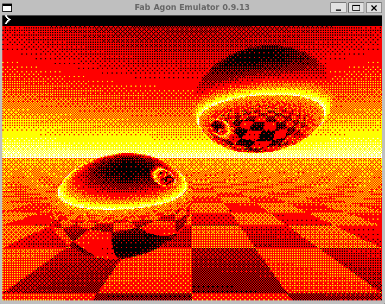

So that gives us the X and Y directions to fire the ray (stated as U and V), but we are in 3D so we also need the Z direction or depth - W.  The next line 100 calculates that using pythagoras. 
It is inverted though as we will always be using this number in a division.

But note the stray `1`?  If that wasn't there you'd get division by zero and things would likely catch fire.

But the programmer isn't finished.  He knows that things are a little off, because we used a shortcut to working out the vector direction of the ray, it is currently still the distance from the centre of the screen in 2D.  To correct this, all you need to do is divide by the calculated Z direction of the ray - i.e. W.  Luckily, it is already a reciprocal so we can simply multiply. Nice.

---
Next, we have this wonderful little line:
```BASIC
  120     I=SGNU:REM is ray facing left or right? I becomes x and y coordinates for sphere
```

The BASIC function SGN(var) will return -1 if "var" is negative, +1 if it is positive, and 0 otherwise.

But what does that mean for SGN(U)?  Well, U is the component of the ray in the X direction.  So it simply tells us if the pixel is in the left or right half of the screen.  This will be important in giving us the two balls later.

Finally Line 130 calls a function with all the calculated values describing the ray's origin `(X,Y,Z)` and it's direction vector `(U,V,W)`, along with that magical little `I`.

## Part 4 : The RAY function : *This is balls.*

```BASIC
  190 DEFFNray(X,Y,Z,U,V,W,I)
  200 E=X-I:F=Y-I:G=Z:REM vector from sphere centre to ray start
  210 P=U*E+V*F-W*G:REM dot product? Z seems to be flipped
  220 D=P*P-E*E-F*F-G*G+1
  230 IF D<=0 THEN =FNc(X,Y,Z,U,V,W):REM didn't hit anything; return colour
  240 T=-P-SQRD:IF T<=0 =FNc(X,Y,Z,U,V,W):REM still didn't hit anything; return colour
  250 X=X+T*U:Y=Y+T*V:Z=Z-T*W:REM new ray start position
  260 E=X-I:F=Y-I:G=Z:REM vector from sphere centre to new ray start
  270 P=2*(U*E+V*F-W*G):REM dot product shenanigans?
  280 U=U-P*E:V=V-P*F:W=W+P*G:REM new ray direction vector
  290 I=-I:REM we'd hit one sphere, so flip x and y coordinates to give other
  300 =FNray(X,Y,Z,U,V,W,I):REM return colour from new ray
```

Lets take this bit by bit.

### The Spheres
First, you may recall from school maths that there is an equation that describes the surface of a sphere.

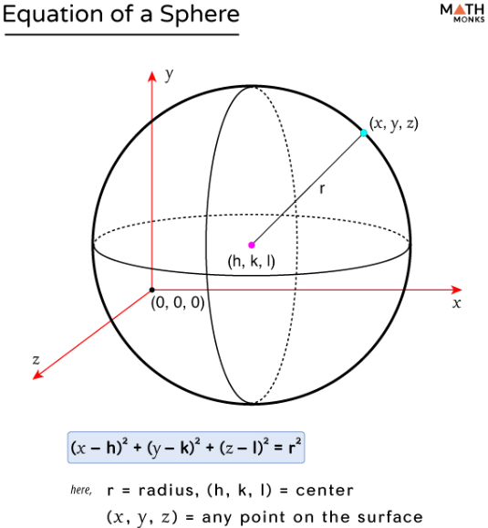

where `(h,k,l)` are the vector to the sphere centre from the origin, and `r` is the radius. Solving this quadratic is effectively what the next few lines do.
(A link to more information on this method is below)


```BASIC
  200 E=X-I:F=Y-I:G=Z:REM vector from sphere centre to ray start
```
Remember `I` is `-1` or `+1` depending on if we are on the left or right.  `X` and `Y` are the ray starting position (initially the camera position), so if we take or add 1 to X or Y we get a point in space to the left and below or to the right and above the camera.  This is where the spheres are placed.

Now the sphere equation can be written as

$$ (x-E)^2 + (y-(F)^2 + (z-G)^2 = 1^2 $$

The next part will solve this equation:

---

```BASIC
  210 P=U*E+V*F-W*G:REM dot product? Z seems to be flipped
  220 D=P*P-E*E-F*F-G*G+1
```

Line 210 calculates A dot-product of the ray direction vector and the sphere centre position. 
In vector maths the dot-product is a simple sum of the multiplication of components, but it has the effect of telling you the magnitude of one vector in the direction of another.
This gives the magnitude of the ray pointed towards the sphere. But the Z direction is flipped, as Christian notes. The reason is because Z reduces going into the screen, and you want the sphere to be ahead of you, not behind.

So, now we have `P` the magnitude of the amount of the ray pointed at the sphere centre.

If you re-write the sphere equation in terms of this value you get 

$$P^2 - R^2 = 0$$

Which is a general quadratic equation.  The roots of this can be calculated using a ***discriminant***.  

Line 220 calculates this.

Note that the `1` in line 220 is the radius of the sphere (squared). You can change the radius of the spheres here.

The solutions to the equation are 

* D is positive, in which case the ray intersects with the sphere, and if we wanted we could get the two roos (intersection points)
* D is zero, the ray hits the sphere tangentially
* D is negative, meaning that the ray doesn't intersect with the sphere

The theory behind this is maths heavy, but it nicely outlined here: 
[Notes on the mathematics of a ray intersecting a sphere](https://www.scratchapixel.com/lessons/3d-basic-rendering/minimal-ray-tracer-rendering-simple-shapes/ray-sphere-intersection.html)

---

```BASIC
  230 IF D<=0 THEN =FNc(X,Y,Z,U,V,W):REM didn't hit anything; return colour
```

So, if D is negative, we missed the sphere entirely, so colour the pixel as either sky or floor. This is calculated in `FNc()` the colour function.  More on that later

---

The purpose of line 240 is to stop a second internal reflection from the otherside of the sphere.

```BASIC
  240 T=-P-SQRD:IF T<=0 =FNc(X,Y,Z,U,V,W):REM still didn't hit anything; return colour
```

If you comment out the IF part, you end up with this: (Note the two weird extra reflctions).

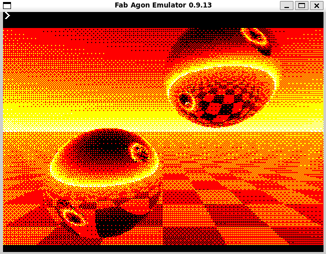

At this point we know D>0 so the ray has hit the sphere, but as I mentioned before, there are 2 solutions to the sphere equation intersection.  We only want the near one.

The two solutions are:

$$ Near :  T = -P - sqrt D $$ 

$$ Far : T = -P + sqrt D $$

So if T is negative we can ignore that ray intersection

### Second Ray

If we reach line 250 we know that the ray has hit a sphere, so lets bounce the ray and see if it hits something else.  This second ray is why you can see the reflection of one sphere on the other.

First get a new vector that has its origin at the centre of the sphere. This is recalculated for the new ray `(X,Y,Z)`.

```BASIC
260 E=X-I:F=Y-I:G=Z:REM vector from sphere centre to new ray start
```

Next we get the dot product we calculated before, to give us the direction vector of the new Ray, but we will be subtracting it (Line 280) from the original direction vector to point it in the opposite direction.

```BASIC
270 P=2*(U*E+V*F-W*G):REM dot product shenanigans?
280 U=U-P*E:V=V-P*F:W=W+P*G:REM new ray direction vector
```

I am not entirely sure why the magnitude has to be doubled, but my guess is that the new ray starts at the centre rather than the surface of the sphere ... 

Finally, we flip `I` and fire a new ray. 
 
```BASIC
290 I=-I:REM we'd hit one sphere, so flip x and y coordinates to give other
300 =FNray(X,Y,Z,U,V,W,I):REM return colour from new ray
```

As I said, my understanding of this is not perfect, and I am not clear as to:

1. why we shouldn't fire the new ray from the sphere it hit, and 

2. how we stop an infinite reflection between spheres. I am led to believe Line 290 is the reason it doesn't do that

*Note*: In BBC Basic a Function can return a value by using the `"="` syntax.

So, we are done with the `FNray()` function, but where is the checkerboard?  Well that is calculated as part of the colour processing.  On to that next ...

## The Colour Function

```BASIC
  310 DEFFNc(X,Y,Z,U,V,W):REM generate pixel colour
  320 IF V>=0 =V:REM facing up at all? return ray Y component for simple sky gradient
  330 P=(Y+2)/V:REM use height for overall checkerboard scale and y component of vector for perspective
  340 =-V*((INT(X-U*P)+INT(Z-W*P)AND1)/2+.3)+.2:REM multiply simple gradient by checkerboard
```

The purpose of this function is to return a colour for the pixel.  It returns a value in the range $0.0 -> 1.0$ and leaves the calculation of the actual colour to the caller of the FNray function.

There are 2 parts here, The Sky, and the Checkerboard.

### The Sky

Sky is drawn if the final ray is pointing upwards (note not just finishing in the top half of the screen, but actually pointing upwards.  
So, if V is positive, just return V.  V will have a low value are the horizon, increasing as it gets to the top.

### The Checkerboard

We have a ray pointing down, we could return that, but we want to modulate the colour value based on whether we are on a "black" or "white" tile.

```BASIC
340 =-V*((INT(X-U*P)+INT(Z-W*P)AND1)/2+.3)+.2:REM multiply simple gradient by checkerboard
```

If Line 340 was just `340 =-V` then a gradated colour would be returned like the sky, but it has to be negated so it ranges again from 0 at the horizon, increasing going downwards this time.

But, we want to keep that part of the effect, so ensure we multiply the next part by V.

Now the checkerboard: `(INT(X-U*P)+ INT(Z-W*P) AND 1` 

The `INT()` function returns the Floor of its argument - turning a float into an int.  

The first uses the horizontal direction of the ray vector to give integers increasing horizontally away from the centre point like this:

```
-4, -3, -2, -1, 0, +1, +2, +3, +4
```

The second does a similar function with the W (i.e. z, into the screen) portion of the ray vector.

Now, you add these together at any point, and simply note if the result is Odd or Even.  That will give you a checkerboard.

The `AND 1` part does that, returning 0 if it is even, 1 if it is odd.

### The Fog

Finally we are left with some odd numbers, you can see the 0/1 is halved and then adjusted.
The important thing here is to note that the halving and then adding back 0.3 and 0.2 before and after the multiplication by V ensures we return a value in the correct range [0.1]

But why?  

First, if we didn't add 0.3 before the multiply by -V, all the black squares would be just black, so we must add something to give the black squares "colour".

But the 0.2 is a bit puzzling.  The best explanation of this I have seen is that this gives a sort of fog where as you go further back towards the horizon (V nears 0) the checkerboard no longer dominates, but is drowned out by the 0.2.  The effect is a *fog* as the floor recedes.  Nice!

Note that we will have two distinct colour ranges after this; [0.0-0.5] - these are the "black" squares, and; [0.5-1.0] - these are the "white" squares.

# Part 4: Colour *A Final Colour and some Dithering*

So, we finally exit the `FNray()` function and end up back in the main loop.
We have a value of between 0->1 that represents the colour of the scene.

If you were to have 256 shades of grey, you could just apply that colour and you are done.  A beautiful grey-scale scene. (I should do this in SDL to show it - but I am so out of time!)

Here is the line that sets the colour :

```BASIC
  140     GCOL0,3-(48*SQRC+A(M MOD4+N MOD4*4)/3)DIV16:REM set draw colour using ordered dithering
```

Lets deal with what colours can be displayed first.

Mode 10, as mentioned is a 320x240 pixel mode with 4 colours:

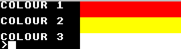

The `3-` flips around the colours to you will get white for lower values of C and Red for Higher. This has the effect of making the horizon brighter as it recedes.

Then you have a `SQRT(C)` expression.  This is so you get a gradual shortening of the changes in colour, with the foreground having least change in colour gradient.

The multiply by 48 is interesting. It is chosen because in the end we will divide by 16 as part of the dithering effect, but we want to keep to 3 colours so 16\*3=48 ensures that.

Without the next part that gives us 

```BASIC
GCOL0,3-(48*SQRC)/3)DIV16
```

This is simply the scene drawn without any dithering in just those four colours: 

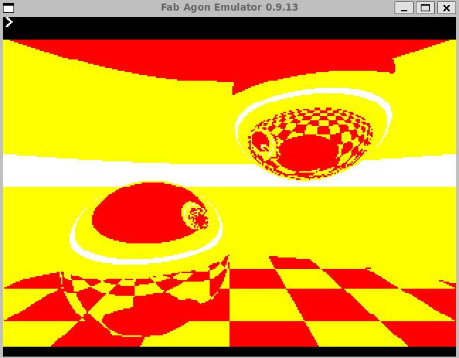

So, lets add dithering!

## Dither

The first line sets up a 4x4 matrix of values

```BASIC
10 DIM A(16):A(0)=0:A(1)=24:A(2)=6:A(3)=30:A(4)=36:A(5)=12:A(6)=42:A(7)=18:A(8)=9:A(9)=33:A(10)=3:A(11)=27:A(12)=45:A(13)=21:A(14)=39:A(15)=15
```

This creates a 16 lement array, which is intended to be used as a 4x4 matrix of numbers. Writen out as a matrix this looks like this:

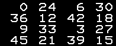

But it will be divided by 3 straight away, so you can consider the values as

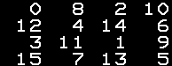

These values are added to the colour value of each pixel in the screen based on where they fall in the 4x4 grid.

This code ` M MOD 4 + (N MOD 4) * 4 ` gives a differnt number acording to which pixel in a 4x4 group it is in, and that is used as an index into the `A()` array

---
```
 ( 48 * Sqrt(C) + Dither(0-15) ) DIV 16
```

The calculation thus takes a Colour value in the range 0-3 (`48 * Sqrt(C)`), and adds a dither value in the range 0-1.
The key is that as the colour value increases, more of the dither table spills over to the next colour.

Still not clear? The following diagrams should help.  The value is the colour value and I highlight which of the dither table values spill over into the next colour.  And you can see a very nice pattern emerging.


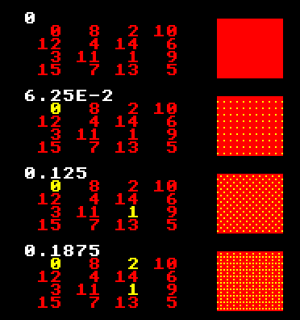

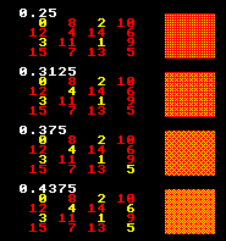

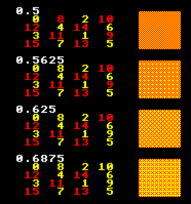

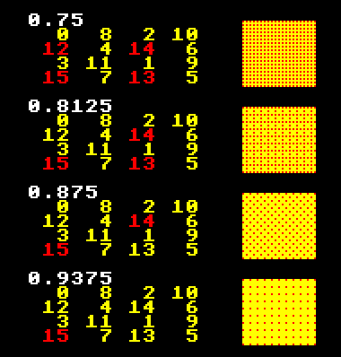


# End

Of course, we are not restricted to 320x240 on the Agon, so here is a render done at 640x480 :

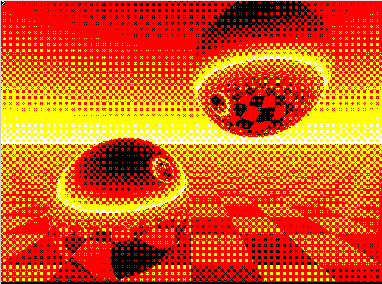

And we are not restricted to 4 colours.
Here is a render using 16 colours at 640x480 pixels.

I have made some modifications to the code to allow this effect, and it is included in this repository as rtcolour.bas.

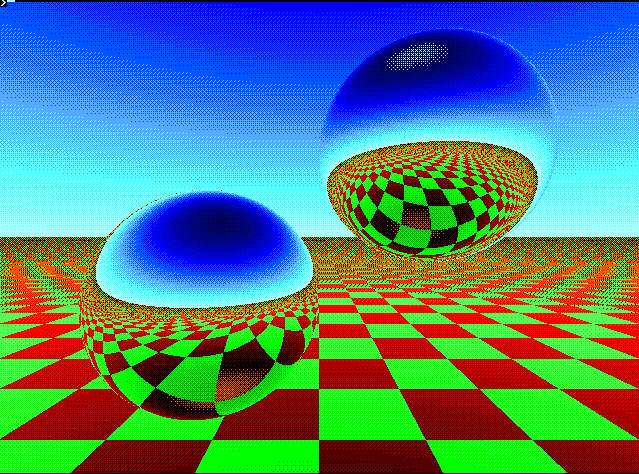

Enjoy!  And Happy Agoning fellow Agoners!

#### *Robogeekoid*

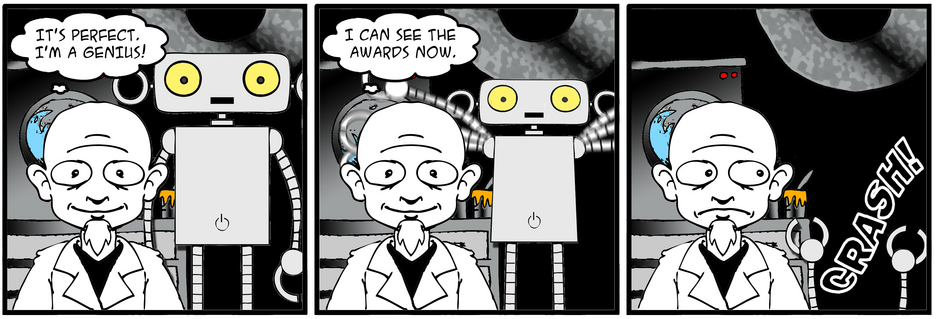
